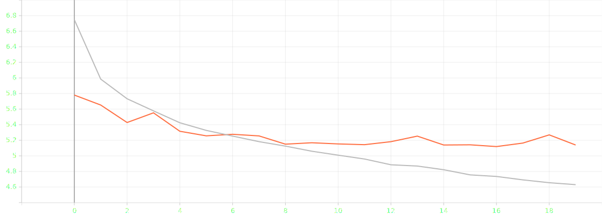
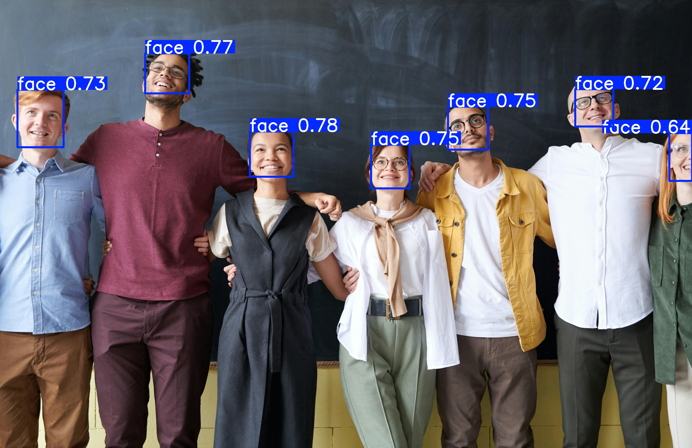

# Finetuning YOLOv5 on a custom dataset

## Environment Setup
Create a virtual environment using `python3 -m venv venv` and activate it:

```bash
source venv/bin/activate
```

Install the dependencies:

```bash
pip install -r requirements.txt
```

## Training

Set the `hyperparameters`, `model_paths` and `dataset_paths` in `src/config.cfg`.

Run the training script:

```bash
python src/train.py
```

## Project Structure

```
├── assets/
├── src/
│ ├── models/
│ ├── yolov5/
│ ├── config.cfg
│ ├── convert_to_yolo.py
│ ├── dataloader.py
│ ├── inference.py
│ ├── helpers.py
│ ├── train.py
├── README.md
├── requirements.txt
├── .gitignore
```
All the files are present in the repository except `yolov5` folder which should be downloaded from [YOLOv5 GitHub](https://github.com/ultralytics/yolov5). It is required as many functions are imported from it.

## Dataset
The dataset used in this project is WIDERFACE dataset and can be accessed [here](http://shuoyang1213.me/WIDERFACE/). The dataset is converted to YOLO format using `convert_to_yolo.py` and is present in `Dataset_YOLO` folder. Note that you may need to change the paths in the script to match your local file structure.

## Training
The training script is present in `src/train.py`. It uses pretrained `yolov5` model present in `src/models/yolov5` for finetuning. The hyperparameters, train path and valid path, and model paths are to be set in `src/config.cfg` file. Make sure to set them before running the script.

## Training Results
The model is finetuned for 20 epochs. The training logs are logged via tensorboard. Training vs Validation loss is plotted using tensorboard. The best model is selected based on the curve. The best model is saved in `src/models/best_model.pt`.

### Training Loss Curve


As seen in the curve, the model is best fit at epoch 5. The validation loss started increasing after epoch 5.

Another phenomenon observed is that the validation loss is less than the training loss during start. This is because of several regularization techniques used in YOLOv5 which are applied during training but not during validation.

## Inference
For inference, run the script `src/inference.py`. You can set the path of the model and image to run the inference on in the script itself. The results are saved in `assets/results` folder.

### Inference Results


## Note
This is entirely a personal project and does not promises any guaranteed results. Any kind of feedback and contributions are welcome. You can either raise an issue for any bugs or raise a PR for any improvements.

